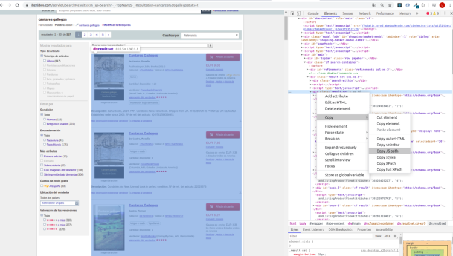
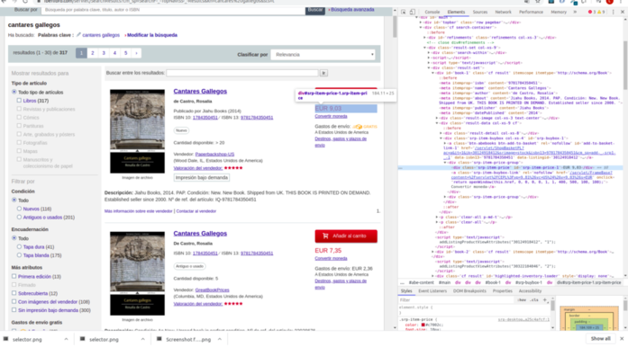
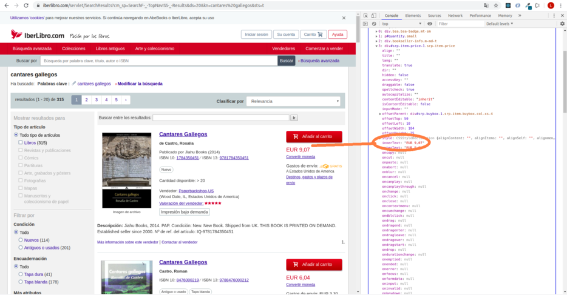

# EJEMPLO DE PRÁCTICA CON SELECTORES

El objetivo es hacer un pequeño análisis sobre una pequeña muestra de datos de precios de un novela o libro concreto. Para ello vamos a jugar un poco con los **"selectores"** en Javascript.Vamos a utilizar una librería (de libros) de internet llamada "IberLibro", vamos a elegir una novela que nos guste y vamos a averiguar **¿quién vende el libro más barato?**

Lo único que vamos a necesitar es tener habilitadas las herramientas de desarrollador en tu navegador.

**¡¡ Al turrón !!**

## Procedimiento:

1. Seleccionar la novela que nos interesa:

   En este caso vamos a "jugar" con la información relativa a una novela esscrita por Rosalía de Castro en 1863 titulada "Cantares Gallegos".
   La url que vamos a usar (también puedes optar por otra novela) sería:

   https://www.iberlibro.com/servlet/SearchResults?cm_sp=SearchF-_-TopNavISS-_-Results&ds=20&kn=cantares%20gallegos&sts=t

   _Es un poco rara, lo sabemos_

   Vamos a intentar descomponerla un poco a ver si se entiende mejor.Sería algo así:

   - Composición dirección url:
     https://www.iberlibro.com/servlet/SearchResults?cm_sp=SearchF-_-TopNavISS-_-Results&kn={TITULO_QUE_QUIERO_BUSCAR}&sts=t

   - {TITULO_QUE_QUIERO_BUSCAR}:
     Titulo de la novela que quieres buscar, pero recuerda que en una url no puede contener el caracter de espacio. Para sustituirlo utilizamos "%20": {TITULO_QUE_QUIERO_BUSCAR} = cantares%20gallegos
   - Otro ejemplo d eurl para buscar "El quijote de la mancha"
     https://www.iberlibro.com/servlet/SearchResults?cm_sp=SearchF-_-TopNavISS-_-Results&kn=el%20quijote%20de%20la%20mancha&sts=t

2. Con la ayuda de los "selectores" encontramos y seleccionamos elementos del DOM que nos interesa para extraer información de cada nodo o manipularlos si así lo consideramos:

    

    _Para obtener rápidamente una referencia a un nodo DOM, hacemos clic con el botón derecho en el nodo DOM y seleccione Copy > Copy JS path. DevTools copia en el portapapeles una expresión document.querySelector () que apunta al nodo._

    ```javascript
    let container = document.querySelector(
      "#main > div.cf.search-container > div.result-set.col-xs-9 > div.result-set"
    );
    console.log(container);
    ```

3. Es conveniente que estudiemos que contiene este elemento, para ver que elementos nos interesan:

    

    En este caso no interesa el precio y algunas características, como el vendedor, la valoración que le da el vendedor, si es usado a nuevo, etc.

    Vamos a ver esto con calma:

    Queremos crear un array que contenga los elementos de `let container` para poder interactuar con ellos:

    ```javascript
    let resultados = [...container.querySelectorAll(".cf.result")];
    console.log(resultados);
    ```

    _Usamos **spread operator** u Operador de Propagación para que nos devuelvan un array y no una NodeList_

    Solo nos interesa cierta inforamción de las que está disponible, por lo que, "mapeamos" para que cada elemento contenga unicamenta la información que nos interesa, como es la información sobre le vendedor, la cantiodad de libros disponibles, el precio, etc:

    ```javascript
    let resultadosFiltrados = resultados.map(el => [
      ...el.querySelectorAll(
        "div.srp-item-price, div.bsa, div.bookseller-info, p#quantity"
      )
    ]);
    console.log(resultadosFiltrados);
    ```

4. Seleccionamos la propiedad de los elementos que nos son útiles:

    ```javascript
    let contenido = [
      ...resultadosFiltrados.map(el => el.map(subel => subel.innerText))
    ];
    console.log(contenido);
    ```

    

5. Ya hemos visto como "trastear" un poquillo con el DOM, pero es posible que queramos traernos algunos datos a otro formato.
   
    Vamos a ir un poquillo más allá y "tunear" un poco la información que tenemos. Queramos iterar con ellos y sería bueno tenerlos en un formato más amigable, por ejemplo en JSON:

    ```javascript
    let data = contenido
      .filter(el => el.length > 0)
      .map(el => {
        Object.assign({}, el);
        if (el.length < 5) {
          return {
            Características: [el[0]], // Características del libro
            Cantidad: parseInt(el[1].slice(21)), //Quedarnos únicamente con la cantidad de libros disponibles en formato numérico
            Vendedor: el[2].slice(10, -27), //Quedarnos únicamente con el nombre y ciudad de la librería
            Precio_EUR: parseFloat(el[3].slice(4).replace(",", ".")) //Quedarnos únicamente con el precio del libro en formato numérico
          };
        }
        if (el.length === 5) {
          return {
            Características: [el[0], el[1]], // Hay libros que tienen dos caraterísticas por lo que el array es de distita longitud
            Cantidad: parseInt(el[2].slice(21)), //Quedarnos únicamente con la cantidad de libros disponibles en formato numérico
            Vendedor: el[3].slice(10, -27), //Quedarnos únicamente con el nombre y ciudad de la librería
            Precio_EUR: parseFloat(el[4].slice(4).replace(",", ".")) //Quedarnos únicamente con el precio del libro en formato numérico
          };
        }
      });
    console.log(data);
    ```
    Una vez que se visualiza la informacíon que genera parece bastante claro, no obstante intentaremos explicar algunos detalles de los datos que manipulamos aqúi:
    - Hay libros que tienen más de una característica. Por ejemplo, si son nuevos o usados, o si son de tapa dura o blanda. Metemos todas estas características en un array, teniendo en cuenta la longitud del array inicial que contiene todos los datos.
    - Tanto la "Cantidad de libros disponibles" como "El precio", los queremos convertir a tipo de dato `number` para poder iterar sobre ellos.
    - Del vendedor, unicamente nos interesa donde está ubicado y su nombre, por lo que, manipulamos la cadena de texto para obtener la información desedada.  

6. Vamos a averiguar quíen vende el libro más barato:

    ```javascript
    let vendedorMasBarato = data.find(el => el.Precio_EUR === Math.min(...data.map(el => el.Precio_EUR)));
    console.log(vendedorMasBarato.Vendedor);
    ```
    
    Si no ves muy claro esta transformación, ¿Qué tal así?

    ``` javascript
    let precios = data.map(el => el.Precio_EUR);
    let minimoPrecio = Math.min(...precios);
    let vendedorMasBarato = data.find(el => el.Precio_EUR === minimoPrecio);
    console.log(vendedorMasBarato.Vendedor);
    ```


