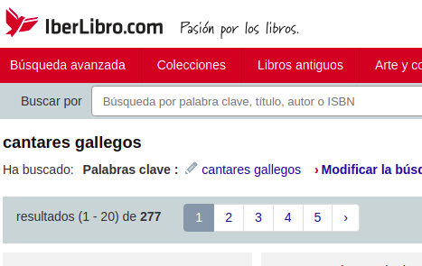

# EJEMPLO DE INICIACION AL WEBSCRAPPING CON PUPPETEER

El objetivo es obtener o "scrapear" los datos de una búsqueda que hagamos, en este caso, de la página de Iberlibro, que ya conocemos del apartado anterior.

Vamos a utilizar _Puppeteer_ que es una librearía de Node que proporciona una API de alto nivel para controlar Chrome o Chromium a través del protocolo DevTools de manera Headless; lo que significa que interactuamos con Chrome sin la interfaz gráfica, es decir, sin un navegador como tal.

**¡¡ Al turrón !!**

## Procedimiento:

1.  Lo primero que debemos hacer es convertir nuestro proyecto en un proyecto de NodeJS, para ello abrimos la terminal en nuestro proyecto:

  ```sh
  npm init -y
  ```

    Esto nos generará automáticamente el fichero `package.json` donde podremos gestionar todas las dependencias.
    El hecho de escribir `-y` nos evita tener que contestar o rellenar características del proyecto como el nombre del autor, versión, etc.

2.  Instalar `puppeteer`:
    Escribimos en la terminal:

  ```sh
  npm i puppeteer
  ```

  Puppeteer incluye la última versión de **chrome / chromium**, que garantiza que podamos trabajar con Chrome en modo headless. Por lo tanto, que no os extrañe que esta instalación demore un poquito.

3.  Vamos a comprobar que `puppeteer` funciona correctamente haciendo algunos ejemplos sencillos. En este caso, vamos a hacer una captura de pantalla de alguna web que nos guste y, además, generar un archivo .pdf con esto:

Creamos el archivo `example.js` donde probaremos escribiremos nuestro código.

  ```sh
  touch example.js
  ```

  En nuestro archivo escribimos:

  ```javascript
  //Cargamos 'puppeteer'
  const puppeteer = require("puppeteer");

  (async () => {
    //Inicializar el navegador Chrome
    const browser = await puppeteer.launch();
    //Crear una nueva página en el contexto del navegador inicializado
    const page = await browser.newPage();
    //Navegar a una página determinada.
    await page.goto("https://example.com");
    //Genera el screenshot y lo salva el la ruta que le indiquemos
    await page.screenshot({ path: "example.png" });
    //Genera el archivo pdf y lo guarda en la ruta que le indiquemos
    await page.pdf({ path: "example.pdf" });
    //Cierra el navegador
    await browser.close();
  })();
  ```

4.  Ejecutamos en nuestra terminal:

  ```sh
  cd 2.Puppeteer/
  node example.js
  ```

**¡Ahora si, empieza el Rock and roll!**

5. Creamos el archivo `puppeteer.js` donde probaremos escribiremos nuestro código.

  ```sh
  touch puppeteer.js
  ```

6. Vamos a hacer un script con el que podamos recoger algunos datos sobre una novela que nos guste publicadas en la página de IberLibro, por ejemplo la del apartado anterior.

  ```javascript
  const puppeteer = require("puppeteer");

  let url = "insert IberLibro URL";

  (async () => {
    const browser = await puppeteer.launch({ headless: false }); // levantamos el servidor de forma gráfica
    const page = await browser.newPage();
    await page.setViewport({ //Ver el navegador con la misma resolución de la pantalla
        width: 1920, 
        height: 1080
      });
    await page.goto(url);

    let data = await page.evaluate(() => {
      let bookData = [];
      let books = document.querySelectorAll(
        "#main > div.cf.search-container > div.result-set.col-xs-9 > div.result-set > div.cf"
      );

      books.forEach(book => {
        let bookJson = {};
        try {
          bookJson.carateristicas = book.querySelector(
            ".bsa.bsa-badge.mt-sm"
          ).innerText;
          bookJson.cantidad = parseInt(
            book.querySelector("#quantity").innerText.slice(21)
          );
          bookJson.vendedor = book
            .querySelector(".bookseller-info.m-md-t")
            .innerText.slice(10, -27);
          bookJson.precio = parseFloat(
            book
              .querySelector(".srp-item-price")
              .innerText.slice(4)
              .replace(",", ".")
          );
        } catch (exception) {
          console.log(exception);
        }
        if (Object.keys(bookJson).length) {
          //Comprobar que el objeto no viene vacío
          bookData.push(bookJson);
        }
      });
      return bookData;
    });

    console.log(data);
  })();
  ```
Ejecutamos en nuestra terminal:

  ```sh
  node puppeteer.js
  ```

7. Hasta ahora vemos los datos desde la consola, lo que pretendemos a continuación es crear un JSON con esta información. Para ello utilizamos el módulo de administración de archivos **fs** que ya viene implementado en NodeJS.
   Este módulo nos permite acceder al sistema de archivos para poder leer sus contenidos y crear otros archivos o carpetas.

  ```javascript
  const puppeteer = require('puppeteer');
  const fs = require('fs');

  let url = 'insert IberLibro URL';

  (async () => {
      const browser = await puppeteer.launch();
      const page = await browser.newPage();
      await page.setViewport({
        width: 1920,
        height: 1080
      });
      await page.goto(url);

      let data = await page.evaluate(() => {
      let bookData = [];
      let books = document.querySelectorAll(
        "#main > div.cf.search-container > div.result-set.col-xs-9 > div.result-set > div.cf"
      );

      books.forEach(book => {
        let bookJson = {};
        try {
          bookJson.carateristicas = book.querySelector(
            ".bsa.bsa-badge.mt-sm"
          ).innerText;
          bookJson.cantidad = parseInt(
            book.querySelector("#quantity").innerText.slice(21)
          );
          bookJson.vendedor = book
            .querySelector(".bookseller-info.m-md-t")
            .innerText.slice(10, -27);
          bookJson.precio = parseFloat(
            book
              .querySelector(".srp-item-price")
              .innerText.slice(4)
              .replace(",", ".")
          );
        } catch (exception) {
          console.log(exception);
        }
        if (Object.keys(bookJson).length) {
          //Comprobar que el objeto no viene vacío
          bookData.push(bookJson);
        }
      });
      return bookData;
    });

    fs.writeFile("data/libros.json", JSON.stringify(data), err => {
        if (err) console.log(err);
        console.log("Successfully Written to File.");
    });
  })();
  ```

Ejecutamos en nuestra terminal:

  ```sh
  node puppeteer.js
  ```

8. Lo siguiente que vamos a hacer es modificar nuestro script para poder acceder a todas las páginas. En la parte superior de la búsqueda puedes ver que hay 277 libros disponibles que en cada página se muestran 20 resultados en el momento de escribir esto:

      

Sería sencillo hacer una división matemática, pero vamos a crear una función con las cosas que hemos aprendido, ya que, estos valores pueden cambiar:

  ```javascript
  const getNumPages = async page => {
    //Función para determinar el número de libros disponibles en nuestra búsqueda
    let cantidadLibros = await page.evaluate(() => {
      return parseInt(
        document.querySelector("#topbar-search-result-count").innerText
      );
    });
    //Función para determinar el número de libros disponibles en una página
    let cantidadLibrosPorPagina = await page.evaluate(() => {
      return [
        ...document.querySelectorAll(
          "#main > div.cf.search-container > div.result-set.col-xs-9 > div.result-set > div.cf"
        )
      ].length;
    });
    //Número de páginas de navegador que debemos iterar:
    return Math.ceil(cantidadLibros / cantidadLibrosPorPagina);
  };
  ```

9. A continuación vamos a modificar nuestro script para que itere por todas las páginas:

  ```javascript
  const puppeteer = require("puppeteer");
  const fs = require("fs");

  // Url de búsqueda
  let url = 'insert IberLibro URL';

  (async () => {
    const browser = await puppeteer.launch({ headless: false });
    const page = await browser.newPage();
    await page.setViewport({ 
      width: 1920, 
      height: 1080
    });
    await page.goto(url);
    const numPages = await getNumPages(page);

    let bookData;
    let data;
    let counter = 0;

    for (let i = 1; i <= numPages; i++) {
      bookData === undefined ? (bookData = []) : (bookData = [...data]);
      data = await page.evaluate(bookData => {
        let books = document.querySelectorAll(
          "#main > div.cf.search-container > div.result-set.col-xs-9 > div.result-set > div.cf"
        );
        books.forEach(book => {
          let bookJson = {};
          try {
            bookJson.carateristicas = book.querySelector(
              ".bsa.bsa-badge.mt-sm"
            ).innerText;
            bookJson.cantidad = parseInt(
              book.querySelector("#quantity").innerText.slice(21)
            );
            bookJson.vendedor = book
              .querySelector(".bookseller-info.m-md-t")
              .innerText.slice(10, -27);
            bookJson.precio = parseFloat(
              book
                .querySelector(".srp-item-price")
                .innerText.slice(4)
                .replace(",", ".")
            );
          } catch (exception) {
            console.log(exception);
          }
          if (Object.keys(bookJson).length) {
            //Comprobar que el objeto no viene vacío
            bookData.push(bookJson);
          }
        });
        return bookData;
      }, bookData);

    if (i < numPages) {
      await page.click("#topbar-page-next");
      //Una vez que hacemos click y pasamos otra página la url cambia,y debemos volcer a definir page  para poder evaluarla:
      let calculateNewUrl = () => {
        counter = counter + 20;
        return `https://www.iberlibro.com/servlet/SearchResults?bsi=${counter}&ds=20&kn=cantares%20gallegos&sortby=20`;
      };
      await page.waitFor(randomWait());
      await page.goto(calculateNewUrl());
    }
  }

  fs.writeFile("data/libros.json", JSON.stringify(data), err => {
    if (err) console.log(err);
    console.log("Successfully Written to File.");
  });

  })();
  ```
Ejecutamos en nuestra terminal:

  ```sh
  node puppeteer.js
  ```

**Comprueba que se ha creado tu archivo correctamente**

10. Como **extra** vamos a añadirle algún detalle a nuestro más script.
  Algunos sitios web pueden detectar que quién visita su web no es un **humano**, sino un **bot**: Algunos sitios tienen, incluso, contramedidas para evitar el web scrapping y nos restrinjan el número de peticiones. 
  Vamos a utiliar utilizar el método **page.wairFor** para pasar de paǵina de una manera aleatoria como haría un "humano":

  ``` javascript
  // Funcion que crea un número aleatorio 
  const MIN_WAIT = 2000;
  const MAX_WAIT = 5000;
  const randomWait = () => {
      return Math.floor(Math.random() * (MAX_WAIT - MIN_WAIT + 1) + MIN_WAIT);
  }
  ```

Añadimos el método **page.waitFor** después de que se produzca el "click":

  ```javascript
  ------------------------------------
  if (i < numPages) {
  await page.click("#topbar-page-next");
  //Una vez que hacemos click y pasamos otra página la url cambia,y debemos volcer a definir page  para poder evaluarla:
  let calculateNewUrl = () => {
    counter = counter + 20;
    return `https://www.iberlibro.com/servlet/SearchResults?bsi=${counter}&ds=20&kn=cantares%20gallegos&sortby=20`;
  };
  await page.waitFor(randomWait());
  await page.goto(calculateNewUrl());
  -----------------------------------
  }
  ``` 
Ejecutamos en nuestra terminal:

  ```sh
  node puppeteer.js
  ```