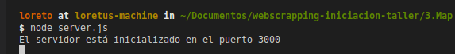

# EJEMPLO PARA SERVIR TU PROPIA API

Una vez que tenemos nuestros datos preparadas, lo que necesitamos es levantarlos en un WebService para que nuestra aplicación pueda servirse de ellos.

Lo que vamos a hacer para ésto en construir un pequeño servidor ayudándonos de Express.js, uno de los frameworks más usados en la actualidad en NodeJs. Simplifica las características básicas de NodeJs, haciendo que sea fácil y sencillo construir el backend de tus aplicaciones. 

**¡¡ Al turrón !!**

## Procedimiento:

1. En nuestra terminal

    ```sh
    npm install express --save
    ```
2. Creamos el archivo `server.js` donde probaremos y escribiremos nuestro código.

    ```sh
    cd 3.Server
    touch server.js
    ``` 
3. Vamos a trabajar sobre el archivo *server.js*:

    ```javascript

    const express = require("express");
    const app = express();
    const fs = require('fs');

    const url = './data/libros.json';
    const data = fs.readFileSync(url, 'utf-8');
    let geoData = JSON.parse(data);

    app.get('/', (req, res) => {
        res.send( geoData);
    });

    app.listen(3000, () => {
    console.log("El servidor está inicializado en el puerto 3000");
    });

    ```
4. Iniciamos el servidor. Para ello escribimos en la terminal:
    ```sh
    node server.js
    ```
5. Si todo ha funcionado correctamente, nuestro servidor estará inicializdo en el puerot 3000, y en muestra consola apareceré el siguiente mensaje:

    

6. Si quieres puedes insertar en tu navegador la url: ```http://localhost:3000/``` y ver como visualizar tus datos.


**¡¡¡ Ahora podrás utilizar tus datos !!!**